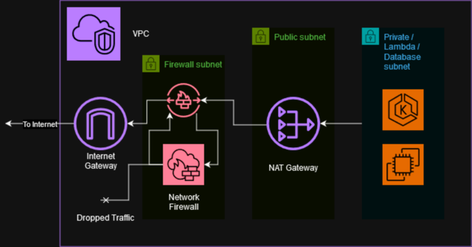

Stacks AWS VPC Module
---------------------

Creates a VPC and a set of opinionated Subnets. Currently this module assumes
no more than 3 Availability Zones and sets up all networks (except Firewall) as
the same size.
This sets up a firewall with all domains allowed by default. This should be
tightened up as you know which domains pods will communicate with outside of the
network.

Subnets are set up one per-AZ and consist of:
 - Firewall - The Firewall resides in this subnet and nothing else should be
   provisioned here
 - Public - Public Load Balancers should reside in here and the NAT Gateways
 - Lambda
 - Database
 - Private - For Private EC2s such as EKS Nodes

The path for traffic from Private/Lambda/Database to the Internet is:


**NOTE:** To force `ingress-nginx` to place the Load Balancers in the Public
Subnets, pass the Subnet IDs into the the annocation for the controller service:
```yml
service.beta.kubernetes.io/aws-load-balancer-subnets: "{{ aws_public_subnets }}"
```
It seems it'll use the Firewall subnets otherwise which are closer to the
Internet.

**NOTE2:** VPC Flow Logging is currently not finished due to a bug in the
downstream module: https://github.com/cloudposse/terraform-aws-vpc-flow-logs-s3-bucket/issues/66

<!-- BEGIN_TF_DOCS -->
## Requirements

| Name | Version |
|------|---------|
| <a name="requirement_terraform"></a> [terraform](#requirement\_terraform) | >= 1.3 |
| <a name="requirement_aws"></a> [aws](#requirement\_aws) | > 5.0 |

## Providers

| Name | Version |
|------|---------|
| <a name="provider_aws"></a> [aws](#provider\_aws) | > 5.0 |

## Modules

| Name | Source | Version |
|------|--------|---------|
| <a name="module_vpc"></a> [vpc](#module\_vpc) | terraform-aws-modules/vpc/aws | ~> 5.1.2 |

## Resources

| Name | Type |
|------|------|
| [aws_cloudwatch_log_group.firewall_alert_log_group](https://registry.terraform.io/providers/hashicorp/aws/latest/docs/resources/cloudwatch_log_group) | resource |
| [aws_cloudwatch_log_group.firewall_flow_log_group](https://registry.terraform.io/providers/hashicorp/aws/latest/docs/resources/cloudwatch_log_group) | resource |
| [aws_eip.nat](https://registry.terraform.io/providers/hashicorp/aws/latest/docs/resources/eip) | resource |
| [aws_internet_gateway.igw](https://registry.terraform.io/providers/hashicorp/aws/latest/docs/resources/internet_gateway) | resource |
| [aws_nat_gateway.public](https://registry.terraform.io/providers/hashicorp/aws/latest/docs/resources/nat_gateway) | resource |
| [aws_networkfirewall_firewall.firewall](https://registry.terraform.io/providers/hashicorp/aws/latest/docs/resources/networkfirewall_firewall) | resource |
| [aws_networkfirewall_firewall_policy.policy](https://registry.terraform.io/providers/hashicorp/aws/latest/docs/resources/networkfirewall_firewall_policy) | resource |
| [aws_networkfirewall_logging_configuration.firewall_logging_config](https://registry.terraform.io/providers/hashicorp/aws/latest/docs/resources/networkfirewall_logging_configuration) | resource |
| [aws_networkfirewall_rule_group.domain_allow_fw_rule_group](https://registry.terraform.io/providers/hashicorp/aws/latest/docs/resources/networkfirewall_rule_group) | resource |
| [aws_networkfirewall_rule_group.icmp_alert_fw_rule_group](https://registry.terraform.io/providers/hashicorp/aws/latest/docs/resources/networkfirewall_rule_group) | resource |
| [aws_route.firewall_to_internet_gw](https://registry.terraform.io/providers/hashicorp/aws/latest/docs/resources/route) | resource |
| [aws_route.ingress_routes](https://registry.terraform.io/providers/hashicorp/aws/latest/docs/resources/route) | resource |
| [aws_route.nat](https://registry.terraform.io/providers/hashicorp/aws/latest/docs/resources/route) | resource |
| [aws_route.public_to_firewall_endpoints](https://registry.terraform.io/providers/hashicorp/aws/latest/docs/resources/route) | resource |
| [aws_route_table.ingress_route_table](https://registry.terraform.io/providers/hashicorp/aws/latest/docs/resources/route_table) | resource |
| [aws_route_table.network_firewall](https://registry.terraform.io/providers/hashicorp/aws/latest/docs/resources/route_table) | resource |
| [aws_route_table.public](https://registry.terraform.io/providers/hashicorp/aws/latest/docs/resources/route_table) | resource |
| [aws_route_table_association.ingress_route_table_gw_association](https://registry.terraform.io/providers/hashicorp/aws/latest/docs/resources/route_table_association) | resource |
| [aws_route_table_association.lambda](https://registry.terraform.io/providers/hashicorp/aws/latest/docs/resources/route_table_association) | resource |
| [aws_route_table_association.network_firewall](https://registry.terraform.io/providers/hashicorp/aws/latest/docs/resources/route_table_association) | resource |
| [aws_route_table_association.public](https://registry.terraform.io/providers/hashicorp/aws/latest/docs/resources/route_table_association) | resource |
| [aws_subnet.lambda](https://registry.terraform.io/providers/hashicorp/aws/latest/docs/resources/subnet) | resource |
| [aws_subnet.network_firewall](https://registry.terraform.io/providers/hashicorp/aws/latest/docs/resources/subnet) | resource |
| [aws_subnet.public](https://registry.terraform.io/providers/hashicorp/aws/latest/docs/resources/subnet) | resource |
| [aws_availability_zones.available](https://registry.terraform.io/providers/hashicorp/aws/latest/docs/data-sources/availability_zones) | data source |

## Inputs

| Name | Description | Type | Default | Required |
|------|-------------|------|---------|:--------:|
| <a name="input_firewall_alert_log_retention"></a> [firewall\_alert\_log\_retention](#input\_firewall\_alert\_log\_retention) | The firewall alert log retention in days | `number` | `7` | no |
| <a name="input_firewall_allowed_domain_targets"></a> [firewall\_allowed\_domain\_targets](#input\_firewall\_allowed\_domain\_targets) | The list of allowed domains which can make it through the firewall | `list(string)` | `[]` | no |
| <a name="input_firewall_deletion_protection"></a> [firewall\_deletion\_protection](#input\_firewall\_deletion\_protection) | Whether to protect the firewall from deletion | `bool` | `true` | no |
| <a name="input_firewall_flow_log_retention"></a> [firewall\_flow\_log\_retention](#input\_firewall\_flow\_log\_retention) | The firewall flow log retention in days | `number` | `7` | no |
| <a name="input_flow_log_allow_ssl_requests_only"></a> [flow\_log\_allow\_ssl\_requests\_only](#input\_flow\_log\_allow\_ssl\_requests\_only) | Set to 'true' to require requests to use Secure Socket Layer (HTTPS/SSL). This will explicitly deny access to HTTP requests | `bool` | `true` | no |
| <a name="input_flow_log_expiry_days"></a> [flow\_log\_expiry\_days](#input\_flow\_log\_expiry\_days) | Number of days after which to expunge the objects | `number` | `90` | no |
| <a name="input_flow_log_force_destroy"></a> [flow\_log\_force\_destroy](#input\_flow\_log\_force\_destroy) | A boolean that indicates all objects should be deleted from the bucket so that the bucket can be destroyed without error. These objects are not recoverable | `bool` | `false` | no |
| <a name="input_flow_log_glacier_transition_days"></a> [flow\_log\_glacier\_transition\_days](#input\_flow\_log\_glacier\_transition\_days) | Number of days after which to move the data to the glacier storage tier | `number` | `60` | no |
| <a name="input_flow_log_noncurrent_version_expiry_days"></a> [flow\_log\_noncurrent\_version\_expiry\_days](#input\_flow\_log\_noncurrent\_version\_expiry\_days) | Specifies when noncurrent object versions expire | `number` | `90` | no |
| <a name="input_flow_log_noncurrent_version_transition_days"></a> [flow\_log\_noncurrent\_version\_transition\_days](#input\_flow\_log\_noncurrent\_version\_transition\_days) | Specifies when noncurrent object versions transitions | `number` | `30` | no |
| <a name="input_flow_log_standard_transition_days"></a> [flow\_log\_standard\_transition\_days](#input\_flow\_log\_standard\_transition\_days) | Number of days to persist in the standard storage tier before moving to the infrequent access tier | `number` | `30` | no |
| <a name="input_region"></a> [region](#input\_region) | AWS region | `string` | n/a | yes |
| <a name="input_tags"></a> [tags](#input\_tags) | Map of infrastructure tags. | `map(string)` | n/a | yes |
| <a name="input_vpc_cidr"></a> [vpc\_cidr](#input\_vpc\_cidr) | The VPC CIDR to create | `string` | n/a | yes |
| <a name="input_vpc_name"></a> [vpc\_name](#input\_vpc\_name) | Name of the VPC and resources | `string` | n/a | yes |

## Outputs

| Name | Description |
|------|-------------|
| <a name="output_id"></a> [id](#output\_id) | The ID of the VPC Created by this module. |
| <a name="output_private_subnet_ids"></a> [private\_subnet\_ids](#output\_private\_subnet\_ids) | The IDs of the private subnets created by this module. |
| <a name="output_public_subnet_ids"></a> [public\_subnet\_ids](#output\_public\_subnet\_ids) | The IDs of the public subnets created by this module. |<!-- END_TF_DOCS -->
<!-- END_TF_DOCS -->
