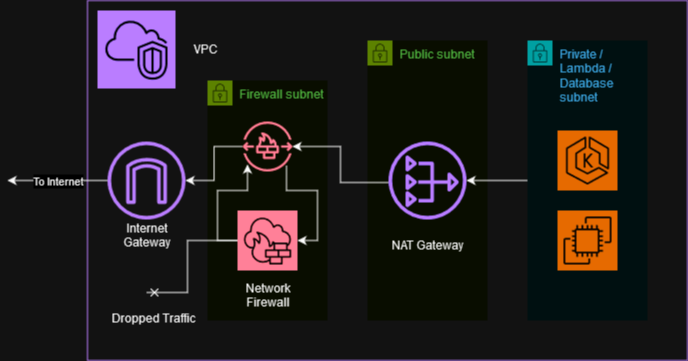

# Stacks AWS VPC Module

BREAKING CHANGE: As of version 7.x this module makes sweeping changes to the
subnet arrangements of the VPC. Upgrading from previous versions will require
heavy manual state changes to ensure that existing subnets don't get destroyed
and recreated. Unfortunately `moved` can't be used here as it doesn't support
`for_each` and it's a non-trivial map to make.
The reason for this change is that the module originally assigned azs for
subnets by the zone names (for private, db), and the wrong ordering for other
subnets.
AWS gives different underlying zones to each account mapped to common names.
This means each account could have a different AZ for the same Zone Name.
AWS Recommends for consistency you map by Zone ID in order.

Creates a VPC and a set of opinionated Subnets. Currently this module assumes
no more than 3 Availability Zones and sets up all networks (except Firewall) as
the same size.
This sets up a firewall with all domains allowed by default. This should be
tightened up as you know which domains pods will communicate with outside of the
network.

Subnets are set up one per-AZ and consist of:

- Firewall - The Firewall resides in this subnet and nothing else should be
  provisioned here
- Public - Public Load Balancers should reside in here and the NAT Gateways
- Lambda
- Database
- Private - For Private EC2s such as EKS Nodes

The path for traffic from Private/Lambda/Database to the Internet is:


**NOTE:** To force `ingress-nginx` to place the Load Balancers in the Public
Subnets, pass the Subnet IDs into the the annotation for the controller service:

```yml
service.beta.kubernetes.io/aws-load-balancer-subnets: "{{ aws_public_subnets }}"
```

It seems it'll use the Firewall subnets otherwise which are closer to the
Internet.

**NOTE2:** VPC Flow Logging is currently not finished due to a bug in the
downstream module: <https://github.com/cloudposse/terraform-aws-vpc-flow-logs-s3-bucket/issues/66>

<!-- BEGIN_TF_DOCS -->

## Requirements

| Name                                                                     | Version  |
| ------------------------------------------------------------------------ | -------- |
| <a name="requirement_terraform"></a> [terraform](#requirement_terraform) | >= 1.5.7 |
| <a name="requirement_aws"></a> [aws](#requirement_aws)                   | >= 5.0   |

## Providers

| Name                                             | Version |
| ------------------------------------------------ | ------- |
| <a name="provider_aws"></a> [aws](#provider_aws) | >= 5.0  |

## Modules

| Name                                                                                                  | Source                                                                          | Version   |
| ----------------------------------------------------------------------------------------------------- | ------------------------------------------------------------------------------- | --------- |
| <a name="module_logging_bucket"></a> [logging_bucket](#module_logging_bucket)                         | terraform-aws-modules/s3-bucket/aws                                             | 4.6.0     |
| <a name="module_logging_bucket_kms_key"></a> [logging_bucket_kms_key](#module_logging_bucket_kms_key) | ../../resource_modules/identity/kms_key                                         | n/a       |
| <a name="module_vpc"></a> [vpc](#module_vpc)                                                          | terraform-aws-modules/vpc/aws                                                   | ~> 5.19.0 |
| <a name="module_vpc_flow_logs"></a> [vpc_flow_logs](#module_vpc_flow_logs)                            | git::<https://github.com/ElvenSpellmaker/terraform-aws-vpc-flow-logs-s3-bucket> | fix/1.3.0 |

## Resources

| Name                                                                                                                                                                                   | Type        |
| -------------------------------------------------------------------------------------------------------------------------------------------------------------------------------------- | ----------- |
| [aws_cloudwatch_log_group.firewall_alert_log_group](https://registry.terraform.io/providers/hashicorp/aws/latest/docs/resources/cloudwatch_log_group)                                  | resource    |
| [aws_cloudwatch_log_group.firewall_flow_log_group](https://registry.terraform.io/providers/hashicorp/aws/latest/docs/resources/cloudwatch_log_group)                                   | resource    |
| [aws_eip.nat](https://registry.terraform.io/providers/hashicorp/aws/latest/docs/resources/eip)                                                                                         | resource    |
| [aws_internet_gateway.igw](https://registry.terraform.io/providers/hashicorp/aws/latest/docs/resources/internet_gateway)                                                               | resource    |
| [aws_nat_gateway.public](https://registry.terraform.io/providers/hashicorp/aws/latest/docs/resources/nat_gateway)                                                                      | resource    |
| [aws_network_acl.database](https://registry.terraform.io/providers/hashicorp/aws/latest/docs/resources/network_acl)                                                                    | resource    |
| [aws_network_acl.lambda](https://registry.terraform.io/providers/hashicorp/aws/latest/docs/resources/network_acl)                                                                      | resource    |
| [aws_network_acl.network_firewall](https://registry.terraform.io/providers/hashicorp/aws/latest/docs/resources/network_acl)                                                            | resource    |
| [aws_network_acl.private](https://registry.terraform.io/providers/hashicorp/aws/latest/docs/resources/network_acl)                                                                     | resource    |
| [aws_network_acl.public](https://registry.terraform.io/providers/hashicorp/aws/latest/docs/resources/network_acl)                                                                      | resource    |
| [aws_network_acl_rule.database_inbound](https://registry.terraform.io/providers/hashicorp/aws/latest/docs/resources/network_acl_rule)                                                  | resource    |
| [aws_network_acl_rule.database_outbound](https://registry.terraform.io/providers/hashicorp/aws/latest/docs/resources/network_acl_rule)                                                 | resource    |
| [aws_network_acl_rule.lambda_inbound](https://registry.terraform.io/providers/hashicorp/aws/latest/docs/resources/network_acl_rule)                                                    | resource    |
| [aws_network_acl_rule.lambda_outbound](https://registry.terraform.io/providers/hashicorp/aws/latest/docs/resources/network_acl_rule)                                                   | resource    |
| [aws_network_acl_rule.network_firewall_inbound](https://registry.terraform.io/providers/hashicorp/aws/latest/docs/resources/network_acl_rule)                                          | resource    |
| [aws_network_acl_rule.network_firewall_outbound](https://registry.terraform.io/providers/hashicorp/aws/latest/docs/resources/network_acl_rule)                                         | resource    |
| [aws_network_acl_rule.private_inbound](https://registry.terraform.io/providers/hashicorp/aws/latest/docs/resources/network_acl_rule)                                                   | resource    |
| [aws_network_acl_rule.private_outbound](https://registry.terraform.io/providers/hashicorp/aws/latest/docs/resources/network_acl_rule)                                                  | resource    |
| [aws_network_acl_rule.public_inbound](https://registry.terraform.io/providers/hashicorp/aws/latest/docs/resources/network_acl_rule)                                                    | resource    |
| [aws_network_acl_rule.public_outbound](https://registry.terraform.io/providers/hashicorp/aws/latest/docs/resources/network_acl_rule)                                                   | resource    |
| [aws_networkfirewall_firewall.firewall](https://registry.terraform.io/providers/hashicorp/aws/latest/docs/resources/networkfirewall_firewall)                                          | resource    |
| [aws_networkfirewall_firewall_policy.policy](https://registry.terraform.io/providers/hashicorp/aws/latest/docs/resources/networkfirewall_firewall_policy)                              | resource    |
| [aws_networkfirewall_logging_configuration.firewall_logging_config](https://registry.terraform.io/providers/hashicorp/aws/latest/docs/resources/networkfirewall_logging_configuration) | resource    |
| [aws_networkfirewall_rule_group.domain_allow_fw_rule_group](https://registry.terraform.io/providers/hashicorp/aws/latest/docs/resources/networkfirewall_rule_group)                    | resource    |
| [aws_networkfirewall_rule_group.icmp_alert_fw_rule_group](https://registry.terraform.io/providers/hashicorp/aws/latest/docs/resources/networkfirewall_rule_group)                      | resource    |
| [aws_networkfirewall_rule_group.tls_alert_fw_rule_group](https://registry.terraform.io/providers/hashicorp/aws/latest/docs/resources/networkfirewall_rule_group)                       | resource    |
| [aws_route.firewall_to_internet_gw](https://registry.terraform.io/providers/hashicorp/aws/latest/docs/resources/route)                                                                 | resource    |
| [aws_route.ingress_routes](https://registry.terraform.io/providers/hashicorp/aws/latest/docs/resources/route)                                                                          | resource    |
| [aws_route.nat](https://registry.terraform.io/providers/hashicorp/aws/latest/docs/resources/route)                                                                                     | resource    |
| [aws_route.public_to_firewall_endpoints](https://registry.terraform.io/providers/hashicorp/aws/latest/docs/resources/route)                                                            | resource    |
| [aws_route.public_to_internet_gw](https://registry.terraform.io/providers/hashicorp/aws/latest/docs/resources/route)                                                                   | resource    |
| [aws_route_table.ingress_route_table](https://registry.terraform.io/providers/hashicorp/aws/latest/docs/resources/route_table)                                                         | resource    |
| [aws_route_table.network_firewall](https://registry.terraform.io/providers/hashicorp/aws/latest/docs/resources/route_table)                                                            | resource    |
| [aws_route_table.public](https://registry.terraform.io/providers/hashicorp/aws/latest/docs/resources/route_table)                                                                      | resource    |
| [aws_route_table_association.ingress_route_table_gw_association](https://registry.terraform.io/providers/hashicorp/aws/latest/docs/resources/route_table_association)                  | resource    |
| [aws_route_table_association.lambda](https://registry.terraform.io/providers/hashicorp/aws/latest/docs/resources/route_table_association)                                              | resource    |
| [aws_route_table_association.network_firewall](https://registry.terraform.io/providers/hashicorp/aws/latest/docs/resources/route_table_association)                                    | resource    |
| [aws_route_table_association.public](https://registry.terraform.io/providers/hashicorp/aws/latest/docs/resources/route_table_association)                                              | resource    |
| [aws_subnet.lambda](https://registry.terraform.io/providers/hashicorp/aws/latest/docs/resources/subnet)                                                                                | resource    |
| [aws_subnet.network_firewall](https://registry.terraform.io/providers/hashicorp/aws/latest/docs/resources/subnet)                                                                      | resource    |
| [aws_subnet.public](https://registry.terraform.io/providers/hashicorp/aws/latest/docs/resources/subnet)                                                                                | resource    |
| [aws_availability_zones.available](https://registry.terraform.io/providers/hashicorp/aws/latest/docs/data-sources/availability_zones)                                                  | data source |
| [aws_caller_identity.this](https://registry.terraform.io/providers/hashicorp/aws/latest/docs/data-sources/caller_identity)                                                             | data source |
| [aws_iam_policy_document.logging_bucket_policy](https://registry.terraform.io/providers/hashicorp/aws/latest/docs/data-sources/iam_policy_document)                                    | data source |
| [aws_iam_policy_document.logging_bucket_secret_encryption_kms_key_policy](https://registry.terraform.io/providers/hashicorp/aws/latest/docs/data-sources/iam_policy_document)          | data source |

## Inputs

| Name                                                                                                                                                                     | Description                                                                                                                                                                          | Type                                                                                                                                                                                                                       | Default                                                                                                                                                                     | Required |
| ------------------------------------------------------------------------------------------------------------------------------------------------------------------------ | ------------------------------------------------------------------------------------------------------------------------------------------------------------------------------------ | -------------------------------------------------------------------------------------------------------------------------------------------------------------------------------------------------------------------------- | --------------------------------------------------------------------------------------------------------------------------------------------------------------------------- | :------: |
| <a name="input_create_database_dedicated_network_acl"></a> [create_database_dedicated_network_acl](#input_create_database_dedicated_network_acl)                         | Whether to use dedicated network ACL (not default) and custom rules for database subnets                                                                                             | `bool`                                                                                                                                                                                                                     | `false`                                                                                                                                                                     |    no    |
| <a name="input_create_lambda_dedicated_network_acl"></a> [create_lambda_dedicated_network_acl](#input_create_lambda_dedicated_network_acl)                               | Whether to use dedicated network ACL (not default) and custom rules for lamda subnets                                                                                                | `bool`                                                                                                                                                                                                                     | `false`                                                                                                                                                                     |    no    |
| <a name="input_create_network_firewall_dedicated_network_acl"></a> [create_network_firewall_dedicated_network_acl](#input_create_network_firewall_dedicated_network_acl) | Whether to use dedicated network ACL (not default) and custom rules for network firewall subnets                                                                                     | `bool`                                                                                                                                                                                                                     | `false`                                                                                                                                                                     |    no    |
| <a name="input_create_private_dedicated_network_acl"></a> [create_private_dedicated_network_acl](#input_create_private_dedicated_network_acl)                            | Whether to use dedicated network ACL (not default) and custom rules for private subnets                                                                                              | `bool`                                                                                                                                                                                                                     | `false`                                                                                                                                                                     |    no    |
| <a name="input_create_public_dedicated_network_acl"></a> [create_public_dedicated_network_acl](#input_create_public_dedicated_network_acl)                               | Whether to use dedicated network ACL (not default) and custom rules for public subnets                                                                                               | `bool`                                                                                                                                                                                                                     | `false`                                                                                                                                                                     |    no    |
| <a name="input_create_tls_alert_rule"></a> [create_tls_alert_rule](#input_create_tls_alert_rule)                                                                         | This variable toggles creation of tls alert rule                                                                                                                                     | `bool`                                                                                                                                                                                                                     | `false`                                                                                                                                                                     |    no    |
| <a name="input_database_inbound_acl_rules"></a> [database_inbound_acl_rules](#input_database_inbound_acl_rules)                                                          | Database subnets inbound network ACLs                                                                                                                                                | <pre>list(object({<br> rule_number = number<br> rule_action = string<br> protocol = any<br> from_port = optional(number, 0)<br> to_port = optional(number, 0)<br> cidr_block = optional(string, "0.0.0.0/0")<br> }))</pre> | <pre>[<br> {<br> "cidr_block": "0.0.0.0/0",<br> "from_port": 0,<br> "protocol": "-1",<br> "rule_action": "allow",<br> "rule_number": 100,<br> "to_port": 0<br> }<br>]</pre> |    no    |
| <a name="input_database_outbound_acl_rules"></a> [database_outbound_acl_rules](#input_database_outbound_acl_rules)                                                       | Database subnets outbound network ACLs                                                                                                                                               | <pre>list(object({<br> rule_number = number<br> rule_action = string<br> protocol = any<br> from_port = optional(number, 0)<br> to_port = optional(number, 0)<br> cidr_block = optional(string, "0.0.0.0/0")<br> }))</pre> | <pre>[<br> {<br> "cidr_block": "0.0.0.0/0",<br> "from_port": 0,<br> "protocol": "-1",<br> "rule_action": "allow",<br> "rule_number": 100,<br> "to_port": 0<br> }<br>]</pre> |    no    |
| <a name="input_domain_allow_capacity"></a> [domain_allow_capacity](#input_domain_allow_capacity)                                                                         | Capacity for Domain allow rule group                                                                                                                                                 | `number`                                                                                                                                                                                                                   | `100`                                                                                                                                                                       |    no    |
| <a name="input_firewall_alert_log_retention"></a> [firewall_alert_log_retention](#input_firewall_alert_log_retention)                                                    | The firewall alert log retention in days                                                                                                                                             | `number`                                                                                                                                                                                                                   | `7`                                                                                                                                                                         |    no    |
| <a name="input_firewall_allowed_domain_targets"></a> [firewall_allowed_domain_targets](#input_firewall_allowed_domain_targets)                                           | The list of allowed domains which can make it through the firewall, e.g. '.foo.com'                                                                                                  | `list(string)`                                                                                                                                                                                                             | `[]`                                                                                                                                                                        |    no    |
| <a name="input_firewall_deletion_protection"></a> [firewall_deletion_protection](#input_firewall_deletion_protection)                                                    | Whether to protect the firewall from deletion                                                                                                                                        | `bool`                                                                                                                                                                                                                     | `true`                                                                                                                                                                      |    no    |
| <a name="input_firewall_enabled"></a> [firewall_enabled](#input_firewall_enabled)                                                                                        | Whether to enable the Firewall                                                                                                                                                       | `bool`                                                                                                                                                                                                                     | `true`                                                                                                                                                                      |    no    |
| <a name="input_firewall_endpoint_per_az"></a> [firewall_endpoint_per_az](#input_firewall_endpoint_per_az)                                                                | Whether to create a firewall endpoint per-AZ or just use one. Note: There are running costs associated with Firewall Endpoints. For Production-like environments this should be true | `bool`                                                                                                                                                                                                                     | `true`                                                                                                                                                                      |    no    |
| <a name="input_firewall_flow_log_retention"></a> [firewall_flow_log_retention](#input_firewall_flow_log_retention)                                                       | The firewall flow log retention in days                                                                                                                                              | `number`                                                                                                                                                                                                                   | `7`                                                                                                                                                                         |    no    |
| <a name="input_flow_log_allow_ssl_requests_only"></a> [flow_log_allow_ssl_requests_only](#input_flow_log_allow_ssl_requests_only)                                        | Set to 'true' to require requests to use Secure Socket Layer (HTTPS/SSL). This will explicitly deny access to HTTP requests                                                          | `bool`                                                                                                                                                                                                                     | `true`                                                                                                                                                                      |    no    |
| <a name="input_flow_log_enabled"></a> [flow_log_enabled](#input_flow_log_enabled)                                                                                        | Whether to enable the VPC Flowlogs, currently false as experimental fixes are applied. See: <https://github.com/cloudposse/terraform-aws-vpc-flow-logs-s3-bucket/issues/66>          | `bool`                                                                                                                                                                                                                     | `false`                                                                                                                                                                     |    no    |
| <a name="input_flow_log_expiry_days"></a> [flow_log_expiry_days](#input_flow_log_expiry_days)                                                                            | Number of days after which to expunge the objects                                                                                                                                    | `number`                                                                                                                                                                                                                   | `90`                                                                                                                                                                        |    no    |
| <a name="input_flow_log_force_destroy"></a> [flow_log_force_destroy](#input_flow_log_force_destroy)                                                                      | A boolean that indicates all objects should be deleted from the bucket so that the bucket can be destroyed without error. These objects are not recoverable                          | `bool`                                                                                                                                                                                                                     | `false`                                                                                                                                                                     |    no    |
| <a name="input_flow_log_glacier_transition_days"></a> [flow_log_glacier_transition_days](#input_flow_log_glacier_transition_days)                                        | Number of days after which to move the data to the glacier storage tier                                                                                                              | `number`                                                                                                                                                                                                                   | `60`                                                                                                                                                                        |    no    |
| <a name="input_flow_log_noncurrent_version_expiry_days"></a> [flow_log_noncurrent_version_expiry_days](#input_flow_log_noncurrent_version_expiry_days)                   | Specifies when noncurrent object versions expire                                                                                                                                     | `number`                                                                                                                                                                                                                   | `90`                                                                                                                                                                        |    no    |
| <a name="input_flow_log_noncurrent_version_transition_days"></a> [flow_log_noncurrent_version_transition_days](#input_flow_log_noncurrent_version_transition_days)       | Specifies when noncurrent object versions transitions                                                                                                                                | `number`                                                                                                                                                                                                                   | `30`                                                                                                                                                                        |    no    |
| <a name="input_flow_log_standard_transition_days"></a> [flow_log_standard_transition_days](#input_flow_log_standard_transition_days)                                     | Number of days to persist in the standard storage tier before moving to the infrequent access tier                                                                                   | `number`                                                                                                                                                                                                                   | `30`                                                                                                                                                                        |    no    |
| <a name="input_icmp_alert_capacity"></a> [icmp_alert_capacity](#input_icmp_alert_capacity)                                                                               | Capacity for ICMP alert rule group                                                                                                                                                   | `number`                                                                                                                                                                                                                   | `100`                                                                                                                                                                       |    no    |
| <a name="input_lambda_inbound_acl_rules"></a> [lambda_inbound_acl_rules](#input_lambda_inbound_acl_rules)                                                                | Lambda subnets inbound network ACLs                                                                                                                                                  | <pre>list(object({<br> rule_number = number<br> rule_action = string<br> protocol = any<br> from_port = optional(number, 0)<br> to_port = optional(number, 0)<br> cidr_block = optional(string, "0.0.0.0/0")<br> }))</pre> | <pre>[<br> {<br> "cidr_block": "0.0.0.0/0",<br> "from_port": 0,<br> "protocol": "-1",<br> "rule_action": "allow",<br> "rule_number": 100,<br> "to_port": 0<br> }<br>]</pre> |    no    |
| <a name="input_lambda_outbound_acl_rules"></a> [lambda_outbound_acl_rules](#input_lambda_outbound_acl_rules)                                                             | Lambda subnets outbound network ACLs                                                                                                                                                 | <pre>list(object({<br> rule_number = number<br> rule_action = string<br> protocol = any<br> from_port = optional(number, 0)<br> to_port = optional(number, 0)<br> cidr_block = optional(string, "0.0.0.0/0")<br> }))</pre> | <pre>[<br> {<br> "cidr_block": "0.0.0.0/0",<br> "from_port": 0,<br> "protocol": "-1",<br> "rule_action": "allow",<br> "rule_number": 100,<br> "to_port": 0<br> }<br>]</pre> |    no    |
| <a name="input_network_firewall_inbound_acl_rules"></a> [network_firewall_inbound_acl_rules](#input_network_firewall_inbound_acl_rules)                                  | Network firewall subnets inbound network ACLs                                                                                                                                        | <pre>list(object({<br> rule_number = number<br> rule_action = string<br> protocol = any<br> from_port = optional(number, 0)<br> to_port = optional(number, 0)<br> cidr_block = optional(string, "0.0.0.0/0")<br> }))</pre> | <pre>[<br> {<br> "cidr_block": "0.0.0.0/0",<br> "from_port": 0,<br> "protocol": "-1",<br> "rule_action": "allow",<br> "rule_number": 100,<br> "to_port": 0<br> }<br>]</pre> |    no    |
| <a name="input_network_firewall_outbound_acl_rules"></a> [network_firewall_outbound_acl_rules](#input_network_firewall_outbound_acl_rules)                               | Network firewall subnets outbound network ACLs                                                                                                                                       | <pre>list(object({<br> rule_number = number<br> rule_action = string<br> protocol = any<br> from_port = optional(number, 0)<br> to_port = optional(number, 0)<br> cidr_block = optional(string, "0.0.0.0/0")<br> }))</pre> | <pre>[<br> {<br> "cidr_block": "0.0.0.0/0",<br> "from_port": 0,<br> "protocol": "-1",<br> "rule_action": "allow",<br> "rule_number": 100,<br> "to_port": 0<br> }<br>]</pre> |    no    |
| <a name="input_private_inbound_acl_rules"></a> [private_inbound_acl_rules](#input_private_inbound_acl_rules)                                                             | Private subnets inbound network ACLs                                                                                                                                                 | <pre>list(object({<br> rule_number = number<br> rule_action = string<br> protocol = any<br> from_port = optional(number, 0)<br> to_port = optional(number, 0)<br> cidr_block = optional(string, "0.0.0.0/0")<br> }))</pre> | <pre>[<br> {<br> "cidr_block": "0.0.0.0/0",<br> "from_port": 0,<br> "protocol": "-1",<br> "rule_action": "allow",<br> "rule_number": 100,<br> "to_port": 0<br> }<br>]</pre> |    no    |
| <a name="input_private_outbound_acl_rules"></a> [private_outbound_acl_rules](#input_private_outbound_acl_rules)                                                          | Private subnets outbound network ACLs                                                                                                                                                | <pre>list(object({<br> rule_number = number<br> rule_action = string<br> protocol = any<br> from_port = optional(number, 0)<br> to_port = optional(number, 0)<br> cidr_block = optional(string, "0.0.0.0/0")<br> }))</pre> | <pre>[<br> {<br> "cidr_block": "0.0.0.0/0",<br> "from_port": 0,<br> "protocol": "-1",<br> "rule_action": "allow",<br> "rule_number": 100,<br> "to_port": 0<br> }<br>]</pre> |    no    |
| <a name="input_public_inbound_acl_rules"></a> [public_inbound_acl_rules](#input_public_inbound_acl_rules)                                                                | Public subnets inbound network ACLs                                                                                                                                                  | <pre>list(object({<br> rule_number = number<br> rule_action = string<br> protocol = any<br> from_port = optional(number, 0)<br> to_port = optional(number, 0)<br> cidr_block = optional(string, "0.0.0.0/0")<br> }))</pre> | <pre>[<br> {<br> "cidr_block": "0.0.0.0/0",<br> "from_port": 0,<br> "protocol": "-1",<br> "rule_action": "allow",<br> "rule_number": 100,<br> "to_port": 0<br> }<br>]</pre> |    no    |
| <a name="input_public_outbound_acl_rules"></a> [public_outbound_acl_rules](#input_public_outbound_acl_rules)                                                             | Public subnets outbound network ACLs                                                                                                                                                 | <pre>list(object({<br> rule_number = number<br> rule_action = string<br> protocol = any<br> from_port = optional(number, 0)<br> to_port = optional(number, 0)<br> cidr_block = optional(string, "0.0.0.0/0")<br> }))</pre> | <pre>[<br> {<br> "cidr_block": "0.0.0.0/0",<br> "from_port": 0,<br> "protocol": "-1",<br> "rule_action": "allow",<br> "rule_number": 100,<br> "to_port": 0<br> }<br>]</pre> |    no    |
| <a name="input_region"></a> [region](#input_region)                                                                                                                      | AWS region                                                                                                                                                                           | `string`                                                                                                                                                                                                                   | n/a                                                                                                                                                                         |   yes    |
| <a name="input_tags"></a> [tags](#input_tags)                                                                                                                            | Map of infrastructure tags.                                                                                                                                                          | `map(string)`                                                                                                                                                                                                              | n/a                                                                                                                                                                         |   yes    |
| <a name="input_tls_alert_capacity"></a> [tls_alert_capacity](#input_tls_alert_capacity)                                                                                  | Capacity for TLS alert rule group                                                                                                                                                    | `number`                                                                                                                                                                                                                   | `100`                                                                                                                                                                       |    no    |
| <a name="input_vpc_cidr"></a> [vpc_cidr](#input_vpc_cidr)                                                                                                                | The VPC CIDR to create                                                                                                                                                               | `string`                                                                                                                                                                                                                   | n/a                                                                                                                                                                         |   yes    |
| <a name="input_vpc_instance_tenancy"></a> [vpc_instance_tenancy](#input_vpc_instance_tenancy)                                                                            | The default tenancy of instances, either 'default' or 'dedicated'                                                                                                                    | `string`                                                                                                                                                                                                                   | `"default"`                                                                                                                                                                 |    no    |
| <a name="input_vpc_name"></a> [vpc_name](#input_vpc_name)                                                                                                                | Name of the VPC and resources                                                                                                                                                        | `string`                                                                                                                                                                                                                   | n/a                                                                                                                                                                         |   yes    |
| <a name="input_vpc_nat_gateway_per_az"></a> [vpc_nat_gateway_per_az](#input_vpc_nat_gateway_per_az)                                                                      | Whether to spin up a NAT Gateway per-AZ or just use one. Note: There are running costs associated with NAT Gateways. For Production-like environments this should be true            | `bool`                                                                                                                                                                                                                     | `true`                                                                                                                                                                      |    no    |

## Outputs

| Name                                                                                                              | Description                                                                                 |
| ----------------------------------------------------------------------------------------------------------------- | ------------------------------------------------------------------------------------------- |
| <a name="output_database_subnet_cidrs"></a> [database_subnet_cidrs](#output_database_subnet_cidrs)                | The CIDR blocks of the database subnets created by this module.                             |
| <a name="output_database_subnet_group_name"></a> [database_subnet_group_name](#output_database_subnet_group_name) | RDS Database subnet name. This is the name of the RDS subnet which includes the VPC subnets |
| <a name="output_database_subnet_ids"></a> [database_subnet_ids](#output_database_subnet_ids)                      | The IDs of the database subnets created by this module.                                     |
| <a name="output_firewall_subnet_cidrs"></a> [firewall_subnet_cidrs](#output_firewall_subnet_cidrs)                | The CIDR blocks of the Network Firewall subnets created by this module.                     |
| <a name="output_firewall_subnet_ids"></a> [firewall_subnet_ids](#output_firewall_subnet_ids)                      | The IDs of the Network Firewall subnets created by this module.                             |
| <a name="output_id"></a> [id](#output_id)                                                                         | The ID of the VPC Created by this module.                                                   |
| <a name="output_lambda_subnet_cidrs"></a> [lambda_subnet_cidrs](#output_lambda_subnet_cidrs)                      | The CIDR blocks of the lambda subnets created by this module.                               |
| <a name="output_lambda_subnet_ids"></a> [lambda_subnet_ids](#output_lambda_subnet_ids)                            | The IDs of the Lambda subnets created by this module.                                       |
| <a name="output_private_route_table_ids"></a> [private_route_table_ids](#output_private_route_table_ids)          | The IDs of the private routing tables                                                       |
| <a name="output_private_subnet_cidrs"></a> [private_subnet_cidrs](#output_private_subnet_cidrs)                   | The CIDR blocks of the public subnets created by this module.                               |
| <a name="output_private_subnet_ids"></a> [private_subnet_ids](#output_private_subnet_ids)                         | The IDs of the private subnets created by this module.                                      |
| <a name="output_public_subnet_cidrs"></a> [public_subnet_cidrs](#output_public_subnet_cidrs)                      | The CIDR blocks of the public subnets created by this module.                               |
| <a name="output_public_subnet_ids"></a> [public_subnet_ids](#output_public_subnet_ids)                            | The IDs of the public subnets created by this module.                                       |
| <a name="output_sorted_vpc_zone_ids"></a> [sorted_vpc_zone_ids](#output_sorted_vpc_zone_ids)                      | The sorted AZ Zone IDs                                                                      |
| <a name="output_sorted_vpc_zone_ids_map"></a> [sorted_vpc_zone_ids_map](#output_sorted_vpc_zone_ids_map)          | The sorted AZ Zone IDs as a map                                                             |

<!-- END_TF_DOCS -->
