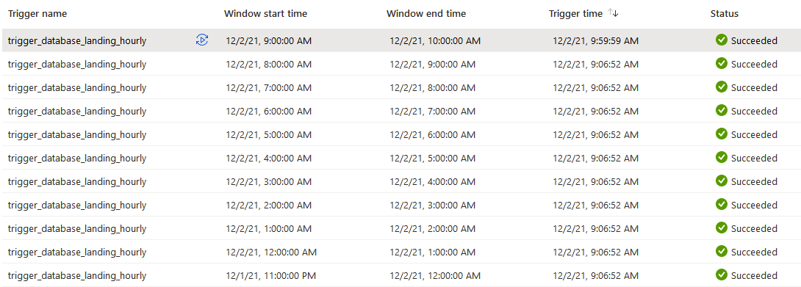
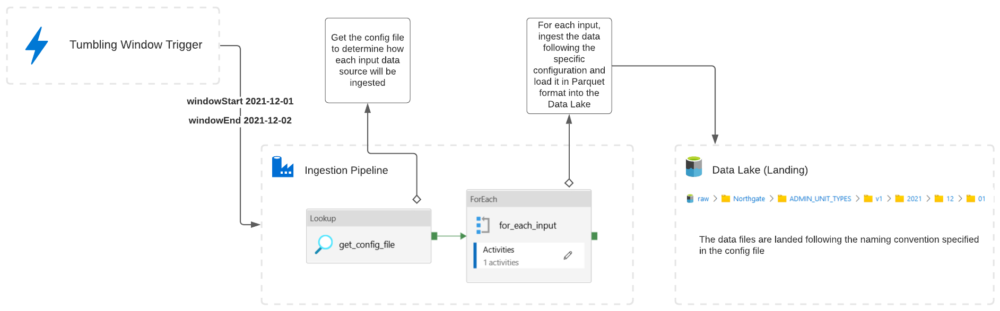
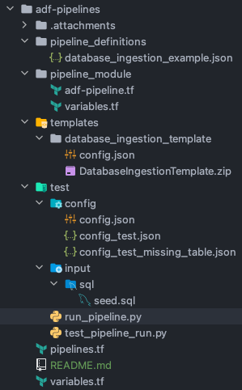
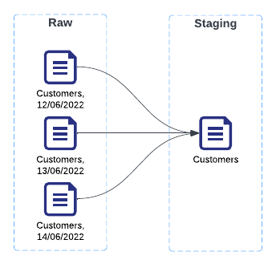

# Data Factory Ingestion Pipeline

## Overview

The data ingestion pipeline aims to copy raw data from various sources to the Data Lake in the simplest and more reliable way possible. The data is written into Parquet files, following the file path convention agreed in the [ADR Data #3: Raw Data Landing on Azure](https://amidodevelopment.atlassian.net/wiki/spaces/TEC/pages/3786801184/ADR+Data+3+Raw+Data+Landing+on+Azure).

## Parameters

| Parameter       | Description                                                                                                       | Required            |
|-----------------|-------------------------------------------------------------------------------------------------------------------|---------------------|
| **windowStart** | The start of the tumbling window (e.g., 2021-12-01 14:00:00)                                                      | Yes                 |
| **windowEnd**   | The end of the tumbling window (e.g., 2021-12-01 15:00:00)                                                        | Yes                 |
| **testConfig**  | The name of a specific config file for testing. Only needed for testing, leave to default (false) for normal run. | No (default: false) |

## Variables

| Variable         | Description                                                                |
|------------------|----------------------------------------------------------------------------|
| **adfName**      | The name of the current Data Factory (e.g. adp-uks-env-d01-core-infra-adf) |
| **env**          | The short name of the current environment (e.g. d01, t01, pat, prod)       |
| **errorFlag**    | It will get a value if any error happens during the ingestion              |
| **pipelineName** | The name of the ingestion pipeline (e.g. northgate_daily)                  |


## Config

Most of the configurations regarding the data source come from a config file. A config file describes each entity that must be ingested (SQL table, file etc.) and how the ingestion should be done. Below are all the values currently accepted in a config file.


| Parameter       | Description                                                                                                                                                                                                            | Options/Example                                                                                                                                                                                                                                                                                                                                                                                                                                                                                                        |
|-----------------|------------------------------------------------------------------------------------------------------------------------------------------------------------------------------------------------------------------------|------------------------------------------------------------------------------------------------------------------------------------------------------------------------------------------------------------------------------------------------------------------------------------------------------------------------------------------------------------------------------------------------------------------------------------------------------------------------------------------------------------------------|
| **entity_type** | The Apache Atlas type of source asset. See the [full list](/Anchor-Platform/Data-Platform/Data-Ingestion/Data-Factory-Ingestion-Pipeline/Apache-Atlas-Dataset-Entity-Types).                                           | azure_sql_table, mssql_table, oracle_table                                                                                                                                                                                                                                                                                                                                                                                                                                                                             |
| **system**      | The system name.                                                                                                                                                                                                       | Northgate, Hyperion, Aggresso                                                                                                                                                                                                                                                                                                                                                                                                                                                                                          |
| **version**     | The version of the schema.                                                                                                                                                                                             | Any integer                                                                                                                                                                                                                                                                                                                                                                                                                                                                                                            |
| **displayName** | How the entity will be called in the Data Lake.                                                                                                                                                                        | PROP_TYPES, Date, Finance etc.                                                                                                                                                                                                                                                                                                                                                                                                                                                                                         |
| **name**        | The name of the entity on the source system.                                                                                                                                                                           | For a database: PROPERTY_ELEMENTS (if the table is not on the default schema, specify it with the **schema** property)<br>For a file: /path/*/file*.csv<br><br>When using with files, wildcard and token substitution can be used. The datetime tokens are substituted with the datetime from the **windowEnd** parameter and follow the standard Microsoft format providers.<br>The current tokens are:<br><br>- **{yyyy}**: Year<br>- **{MM}**: Month<br>- **{dd}**: Day<br>- **{HH}**: Hours<br>- **{mm}**: Minutes |
| **schema**      | The schema for database sources.                                                                                                                                                                                       |                                                                                                                                                                                                                                                                                                                                                                                                                                                                                                                        |
| **type**        | The type of ingestion pattern for databases. **full** ingests the whole table, **incremental** ingests a slice of data based on the parameters windowStart and windowEnd (tumbling window) and the **delta** property. | full<br>incremental                                                                                                                                                                                                                                                                                                                                                                                                                                                                                                    |
| **delta**       | The column or expression to use with the incremental ingestion pattern.                                                                                                                                                | AUS_MODIFIED_DATE<br>COALESCE(PEL_MODIFIED_DATE, PEL_CREATED_DATE)                                                                                                                                                                                                                                                                                                                                                                                                                                                     |
| **granularity** | Determines the datetime portion of the path the file will be saved in the Data Lake.                                                                                                                                   | For a tumbling window ending on _2021-12-02 14:15:00_ the different values would produce (where * is the filename):<br><br>**month**: 2021/12/\*<br>**day**: 2021/12/02/\*<br>**hour**: 2021/12/02/14/\*<br> **minute**: 2021/12/02/14/15/*                                                                                                                                                                                                                                                                            |
| **recursive**   | For file source only, determines if all the matching files in sub directories should be ingested or not when using a wildcard in the **name** property.                                                                |                                                                                                                                                                                                                                                                                                                                                                                                                                                                                                                        |

## Trigger

A tumbling window is a continuous and non-overlapping time interval. It allows reliable incremental data ingestion and, in Data Factory, allows to re-run specific windows later if an error happens and guaranties that no data will be lost. 

Each pipeline is attached to a tumbling window trigger. The trigger can be setup to any granularity down to 5 minutes. Every time it triggers a pipeline, it automatically passes the **windowStart** and **windowEnd** parameters for the relevant time window.<br>
If any kind of incident happens, the missing or failed time windows will run retroactively as soon as possible, either sequentially or in parallel (following the **Max concurrency** option). The benefit of this behaviour it that it guaranties that no time windows are lost or forgotten even if ran days later. Data Factory allows us to re-run individual time windows at will, even if they succeeded.



In the screenshot above, the trigger is setup to run hourly. For example, at 11:00 AM, the pipeline will be triggered with for the time window 10:00 AM to 11:00 AM. Window start time and Window end time are the start and the end of the time window, Trigger time is the time the pipeline was actually triggered.<br>
In this example, the system was turned off on 01/12/2021 before 11:00 PM. When it was turned back on 02/12/2021 at 09:06 AM, it immediately triggered the missed time windows (between 01/12/2021 11:00 PM and 02/12/2021 09:00 AM).
At 09:59:59 AM, the pipeline was automatically triggered and ran the time window between 09:00 AM and 10:00 AM).

Other types of triggers are available based on date or even of new files detection.

## Flow



## Folder Structure

Ingestion pipelines are built with Terraform and are organised following a standard structure (under the `adf-pipelines` folder):



Each pipeline has its own json definition and entry in the `pipelines.tf` file.
```
adf-pipelines                                   : root folder
├── pipeline_definitions                        : folder containing the pipeline definitions (json files)
│   ├── database_ingestion_example.json         : example of a database ingestion pipeline
├── pipeline_module                             : folder containing the pipeline module (instances of this module are declared in the pipelines.tf file)
├── pipelines.tf                                : file containing the pipeline instances
├── templates                                   : folder containing the pipeline templates
├── test                                        : folder containing an example of a test for a pipeline
```

## Data Staging

### \*\*NOT CURRENTLY IMPLEMENTED\*\*

The goal of the staging step is to consolidate each asset’s raw files into a single, de-duplicated data file. This file is the current “version of the truth” and can be used to report accurately on data.



Raw files can:
- Be incomplete
- Contain duplicates
- Be empty

Staging files are:
- Complete, they contain the whole data
- Free of duplicates

## Data Curation

### \*\*NOT CURRENTLY IMPLEMENTED\*\*

The curation step consolidates multiple staging files (from the same or different systems) into a curated data file. The curated data files reprensent entities (e.g a property, a person etc.) and are meant to be used in one or multiple data marts. They use user-friendly field names and should reflect the business language when possible. These data files can then be used to build data marts.